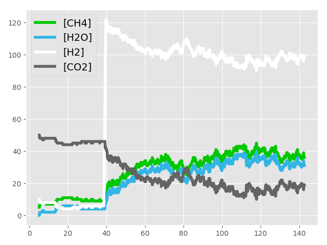

# chem_equilibrium_simulation

A particle-simplified molecular simulation of chemical equilibrium and Le Chatelier's Principle, used as a class demo for IB Chemistry (SCH4UE). The reaction simulated is the Sabatier process, CH4 + H2 &lt;=> H2O + CO2. Requires PyGame and Matplotlib.

 
The simulation speed was set very slow intentionally. Use up arrow and down-arrow to control the tickrate of the simulation. Press right to view concentration-time graph of the system. Press x to add more H2 molecules.

On the right: concentration-time graph. When there is a change in equilibrium concentrations (spike in [H2]), the system will shift to use up more reactants and achieve a new state of equilibrium.
